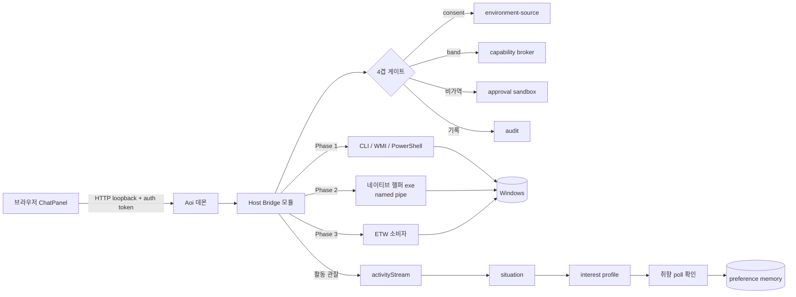

# Aoi Host Access Design — Aoi가 실제 PC를 인지하고 제어하는 구조

상태: 설계 초안 (구현 전)
대상 독자: Aoi 데몬 / 자율성 파이프라인 유지보수자, Windows 보안 엔지니어
작성 기준일: 2026-07-18

---

## 0. 요약 (TL;DR)

Aoi는 지금 브라우저 안에서만 살아있지 않다. 이미 **로그온 시 시작되는 24/7 Node 데몬**(`aoiDaemonServer.ts`,
Scheduled Task `AoiAutonomyDaemon`)이 실제 PC에서 돌고 있고, 그 데몬은 이미 `child_process.spawn`으로
실제 프로세스를 띄우고 파일을 쓴다. 다만 그 능력이 **워크스페이스 검증(pnpm/git allowlist)** 범위로 꽉 잠겨 있을 뿐이다.

따라서 "Aoi가 내 PC에 접근한다"는 것은 **새 실행 채널을 여는 문제가 아니라, 이미 있는 데몬의 OS 접근 표면을
넓히되 이미 있는 4겹 안전장치(consent → capability broker → approval sandbox → audit)에 그대로 태우는 문제**다.
새 보안 모델을 만들면 안 된다.

넓혀야 할 4개 도메인:

1. **프로세스 인식(read)** — 실행 중 프로세스 목록/요약 (metadata-only)
2. **프로세스 제어(mutate)** — 새 실행(spawn) / 종료(kill)
3. **파일시스템(read + mutate)** — 워크스페이스 밖의 사용자 승인 루트
4. **실 PC 활동 인식(read)** — 포그라운드 창/포커스/유휴 → 취향 학습

핵심 결정:

- 데몬을 **단일 신뢰 경계(single trust boundary)** 로 유지한다. 브라우저/LLM은 절대 OS를 직접 만지지 않는다.
- 데몬은 **일반 사용자 권한**으로만 실행한다(관리자/SYSTEM 금지). 이건 제약이 아니라 최대의 안전장치다.
- 모든 신규 접근은 기존 environment-source consent(기본 OFF) + capability band + approval sandbox + audit에 태운다.
- 네이티브 접근은 1차로 CLI/WMI/PowerShell(즉시 가능), 2차로 경량 네이티브 헬퍼(활동 인식), 3차(선택)로 ETW.
  **커널 드라이버는 이 스코프 밖.**
- 전역 킬스위치(패닉 버튼)와 per-source/per-capability 토글은 필수 선행 조건.

---

## 1. 현재 상태와 격차

### 1.1 이미 있는 것 (재사용 자산)

| 자산 | 위치 | 지금 하는 일 |
|---|---|---|
| 24/7 데몬 | `aoiDaemonServer.ts` + `Install-AoiDaemonService.ps1` | 로그온 시작, 슈퍼바이저 crash-loop guard, `127.0.0.1:7333` loopback, `/api/aoi-autonomy/*` + session-data + research |
| 실행 프리미티브 | `aoiApprovedCommandRunner.ts` | `spawn(program, args, {shell:false, windowsHide:true})` 로 실제 프로세스 실행 — 단 `pnpm`/`git` allowlist, cwd ⊂ workspaceRoot, L5 + 승인 지문 + 5분 TTL + audit |
| 파일 변경 프리미티브 | `aoiApprovedFileMutationRunner.ts` | 승인 샌드박스 기반 파일 쓰기 |
| consent 레지스트리 | `aoiAutonomyStore.ts` (환경 소스) | `workspace-git`, `app-activity`, `browser-context`, `calendar-metadata` 등. 전부 `defaultEnabled=false`, scope(`workspace`/`project`/`session`/`explicit_target`), `allowedOperations`(`read_metadata`/`summarize`/`status`/`diff`/`summarize_counts`), `consentReason` 필수. 읽기·쓰기 양쪽 fail-closed |
| capability broker | `aoiCapabilityRegistry.ts` | surface(`automation`, `diagnostics`, ...), access(`read`/`write`/`execute`/`irreversible`), risk, approval(`none`/`policy-gated`/`user-confirmation`), sandboxEligible |
| 승인 샌드박스 | `aoiApprovalSandbox.ts` | content-addressed preview + approval fingerprint + TTL, 재실행 시 지문 재검증 |
| 활동 스트림 | `aoiActivityStream.ts` | metadata-only(구조적으로 params/content 필드 없음), 24h TTL, consent-gated read+write |
| 상황/취향 파이프라인 | `aoiCurrentSituationModel.ts` → `aoiInterestProfile` → preference memory | 활동 → 상황 → 관심 프로필 → 취향 기억 (방금 near-dup 정리한 그 경로) |
| 감사 저장 | `commandAuditDir`, `fileMutationAuditDir`, `appActionAuditDir`, `connectorCallAuditDir` | 실행별 audit 레코드 + evidence refs |

즉 **"실제 PC에서 프로세스를 spawn한다"는 것 자체는 이미 프로덕션에 있다.** 잠금 범위만 좁을 뿐이다.

### 1.2 격차

- **프로세스 인식 없음**: 로컬 머신 인식은 `collectAndPersistAoiWorkspaceSnapshot`의 git 상태뿐. 실행 중 프로세스 목록을 모른다.
- **프로세스 제어 없음**: 임의 프로그램 spawn / 임의 프로세스 kill 경로가 없다(allowlist가 pnpm/git뿐).
- **파일시스템 범위 제한**: `isPathInsideRoot`로 workspaceRoot / session-data root 안으로만. 그 밖의 사용자 파일 접근 불가.
- **실 PC 활동 인식 없음**: 포그라운드 창, 앱 포커스, 유휴 시간을 못 본다 → "실제로 뭘 하며 시간을 쓰는지" 기반 취향 학습이 불가능. 현재 취향 신호는 인앱 유튜브 검색/취향 poll뿐.

---

## 2. 아키텍처 원칙 (설계 불변식)

1. **단일 신뢰 경계.** 데몬만 OS를 만진다. 브라우저·LLM 엔드포인트·프록시는 데몬에 *요청*만 하고, 데몬이 정책을 최종 강제한다.
   LLM이 무엇을 "제안"하든 데몬의 게이트를 못 넘으면 아무 일도 안 일어난다.
2. **새 보안 모델 금지.** 신규 접근은 전부 기존 4겹에 태운다:
   consent(environment-source, 기본 OFF) → capability broker(밴드) → approval sandbox(비가역 동작) → audit(모든 실행 기록 + 되돌리기 evidence).
3. **읽기 ≠ 쓰기, 관찰 ≠ 제어.** 프로세스 목록 읽기와 프로세스 kill은 완전히 다른 권한 등급. 파일 stat과 파일 delete도 마찬가지.
4. **최소 권한.** 데몬은 **일반 사용자 권한**으로만 실행. 관리자/SYSTEM 승격 금지. 결과적으로 관리자 권한 프로세스는 *관찰만* 가능하고
   제어는 OS가 거부한다 — 이건 버그가 아니라 설계상 안전 상한이다.
5. **Fail-closed.** consent 토글이 꺼져 있으면 아무것도 안 읽고 아무것도 안 한다. 레지스트리를 못 읽으면 "동의 없음"으로 읽는다.
6. **킬스위치 우선.** 전역 패닉(모든 host-bridge 즉시 OFF)과 per-source/per-capability 토글은 어떤 실행 기능보다 먼저 구현한다.
7. **로컬 인증.** loopback 바인딩만으로는 부족하다(같은 PC의 다른 프로세스가 `127.0.0.1:7333`을 때릴 수 있다).
   브라우저↔데몬 간 파일 권한 기반 shared-secret 토큰으로 발신자를 인증한다.

---

## 3. Host Bridge — 신규 접근 도메인 설계

새 모듈군 `aoiHostBridge*` 를 데몬 안에 둔다. 각 도메인은 위 4겹을 통과한다.

### 3.1 프로세스 인식 (read) — 신규 소스 `process-activity`

**무엇을 읽나:** pid, 이미지 이름(`Tavern.exe`), 시작 시각, 부모 pid, 대략적 CPU/메모리, (선택) 서명자.
**무엇을 안 읽나(기본):** 커맨드라인 인자 전체 — 시크릿/토큰 유출 표면이므로 기본 캡처 OFF. 별도 토글로만.

consent 소스 정의(기존 레지스트리에 추가):

```ts
{
  id: 'process-activity',
  kind: 'metadata',
  scope: 'explicit_target',
  defaultEnabled: false,
  allowedOperations: ['read_metadata', 'summarize_counts'],
  // consentReason: 사용자가 토글할 때 입력
}
```

구조적 metadata-only 원칙은 `aoiActivityStream`과 동일하게 강제한다: 캡처 이벤트 타입에 자유 텍스트 필드를 두지 않고,
검증된 슬러그(image name)와 카운트만 저장한다. 프로세스 목록 요약은 활동 스트림/상황 모델에 관찰로 흘려보낸다.

### 3.2 프로세스 제어 (mutate) — 가장 위험한 표면

두 capability를 신설한다(`aoiCapabilityRegistry`):

| capability | surface | access | risk | approval | 되돌리기 |
|---|---|---|---|---|---|
| `os_process_spawn` | automation | execute, irreversible | high | user-confirmation | spawn된 pid를 audit → 필요 시 kill로 회수 |
| `os_process_kill` | automation | execute, irreversible | high | user-confirmation | **불가** (명시 경고) |

**spawn 정책:**

- **allowlist 우선.** 사용자가 설정 UI에서 등록한 실행 파일(절대 경로) / 앱만. 자유 경로 spawn은 초기엔 금지.
- `shell:false` + **인자 배열**만(문자열 명령 금지) — 셸 메타문자/인자 인젝션 원천 차단(기존 커맨드 러너와 동일 자세).
- 승인 샌드박스: 정확한 `exe path + args`를 지문화, preview, 사용자 승인, 5분 TTL. 지문 불일치 = 차단.

**kill 정책 (되돌릴 수 없으므로 가장 보수적으로):**

- **보호 프로세스 목록(절대 kill 불가):**
  1. 데몬 자신 + 그 부모/자식(self-protection).
  2. OS 크리티컬: `csrss`, `wininit`, `services`, `lsass`, `smss`, `winlogon`, `System`, `Registry` 등.
  3. **안티치트 보호 프로세스**: `Tavern.exe`, `TavernMaster.dll` 호스트, `TavernWorker.exe` 등 — 애초에 PPL/보호
     프로세스라 `OpenProcess(PROCESS_TERMINATE)`가 OS 레벨에서 거부되지만, 브릿지는 **시도 자체를 정책으로 차단**한다.
     (안티치트 보호를 우회하려는 어떤 시도도 그 자체가 치트 우회 표면이므로, 우아하게 실패시키고 절대 우회하지 않는다.)
- **pid 재사용 TOCTOU 방지**: kill 요청은 `pid + image name + startTime`을 함께 지문화한다. 실행 직전 재확인해서 시작 시각이
  바뀌었으면(= 다른 프로세스가 그 pid를 재사용) 차단한다.
- 승인 샌드박스 + `recoveryPlan.kind = 'not_applicable'` + "종료는 되돌릴 수 없음" 명시 경고.

두 동작 모두 신규 `processActionAuditDir`에 audit(기존 `commandAuditDir` 패턴). 레이트 리밋(분당 N회)으로 폭주 차단.

### 3.3 파일시스템 (read + mutate)

**현재:** session-data(앱 데이터), workspace(git) — 둘 다 root 안으로 제한(`isPathInsideRoot`).

**확장:** 사용자가 등록한 **허용 루트 집합(consent roots)**. 예: `D:\work\game-security`, `C:\Users\kernulist\Documents\notes`.
루트별로 read / write 밴드를 따로 켠다.

- **read**: 신규 소스 `filesystem-read`(scope `explicit_target`, 루트별). 디렉토리 목록/`stat`(metadata) 과 파일 내용(content) 분리 —
  content 읽기는 별도 operation.
- **write / delete**: 기존 `aoiApprovedFileMutationRunner` 확장. 대상 경로가 허용 루트 안인지(`realpath` 후 재검증) + 승인 샌드박스 + audit.
  **delete는 비가역** → 기본은 **휴지통 이동**(Shell recycle) 우선, 영구 삭제는 별도 명시 승인.
- **경로 안전**: `isPathInsideRoot`는 이미 있으나, **심볼릭 링크/junction 우회**를 막으려면 `fs.realpathSync` 후 루트 재검증이 필수.
  junction/reparse point는 기본 거부(옵션).

### 3.4 실 PC 활동 인식 (read) — 취향 학습의 핵심

**무엇을 읽나:** 포그라운드 창(앱 이름 + 창 제목), 앱 포커스 전환, 입력 유휴 시간, 활성 프로세스. 전부 metadata-only.

consent 소스 `desktop-activity`(scope `explicit_target`, 기본 OFF). **창 제목은 민감**(파일 경로/이메일 제목/URL 노출)하므로
**제목 캡처를 별도 하위 토글**로 두고, 캡처하더라도 `redactAoiSensitiveContent`로 경로/이메일/토큰을 마스킹한다.

**파이프라인(기존 경로 그대로 재사용):**

```
desktop-activity 캡처
  → aoiActivityStream (metadata-only, 24h TTL, consent-gated)
  → aoiCurrentSituationModel (evidence-cited 상황)
  → aoiInterestProfile (관심 프로필)
  → 취향 poll 확인 → preference memory (near-dup 정리된 병합 경로)
```

**취향 학습 자세:** "어떤 앱/파일/사이트를 얼마나 오래 쓰는가"는 관심 *신호*로만 쌓는다.
**암묵 관찰만으로 취향을 단정해 preference memory로 승격하지 않는다.** 승격은 지금처럼 취향 poll 질문 또는 명시 확인을 거친다
(예: "요즘 Ghidra를 자주 쓰던데, 리버싱을 더 파고들고 싶어?"라고 *물어본 뒤* 답을 저장). 이렇게 해야 프라이버시와
"내가 통제하는 기억" 원칙이 유지된다.

---

## 4. 확장된 Consent & 안전 모델

| 계층 | 신규 항목 | 강제 지점 |
|---|---|---|
| consent (environment-source) | `process-activity`, `filesystem-read`, `desktop-activity` (+ write는 capability로) | 전부 `defaultEnabled=false`, 설정 UI 개별 토글, `consentReason` 필수, read/write fail-closed |
| capability broker | `os_process_spawn`, `os_process_kill`, `os_file_write`, `os_file_delete` | band: 관찰(read_metadata) → 가역 → 비가역; 비가역은 approval `user-confirmation` |
| approval sandbox | spawn(exe+args) / kill(pid+image+startTime) / write(경로+내용해시) / delete(경로) | content-addressed 지문 + preview + TTL, 재실행 시 재승인 |
| audit | `processActionAuditDir` 신설, `fileMutationAuditDir` 확장 | 모든 mutate 기록 + evidence refs + 되돌리기 정보 |
| 킬스위치 | 전역 패닉 + per-source + per-capability | 데몬 최상단 게이트(다른 모든 검사보다 먼저) |
| 레이트 리밋 | spawn/kill/delete 빈도 상한 | 브릿지 진입점 |

---

## 5. 위협 모델 (필수)

데몬이 프로세스를 죽이고 파일을 지울 수 있게 되는 순간, **프롬프트 인젝션 또는 악성/탈취된 LLM 엔드포인트 = RCE 등가**가 된다.
보안 엔지니어 관점에서 공격 표면과 완화를 명시한다.

| # | 공격 표면 | 완화 |
|---|---|---|
| T1 | LLM 엔드포인트 탈취/프롬프트 인젝션 → 임의 kill/spawn/delete 제안 | LLM은 *제안*만. 데몬 게이트(allowlist + 승인 샌드박스 지문)가 최종 강제. 비가역은 사용자 승인 필수. no-self-promotion 구조 배리어 유지 |
| T2 | 로컬 다른 프로세스가 `127.0.0.1:7333`에 명령 | loopback + **파일 권한 기반 shared-secret 토큰**으로 발신자 인증. 토큰 없는 요청 거부 |
| T3 | 승인 UI 우회/피싱(지문 불일치를 사용자가 승인) | preview에 정확한 대상(exe/pid/경로) 표기, 지문 불일치 시 강제 재승인, TTL 짧게(5분) |
| T4 | 경로 이스케이프 / 심볼릭 링크 / junction | `realpath` 후 루트 재검증, reparse point 기본 거부, `..` 차단(기존 `isPathInsideRoot` + 강화) |
| T5 | pid 재사용 TOCTOU (kill 대상이 바뀜) | `pid + image + startTime` 지문, 실행 직전 재확인 |
| T6 | 감사 로그/활동 캡처 자체가 시크릿 유출 | `redactAoiSensitiveContent` 재사용, 커맨드라인/창 제목 기본 OFF, 로컬 저장만(외부 전송 금지), TTL |
| T7 | 데몬 바이너리/설정 변조 | 데몬 번들 서명·무결성 검증(선택, 안티치트 팀 역량 활용), 설정 파일 권한 |

**명시적 안티골(하지 않을 것):**

- 데몬을 SYSTEM/관리자로 승격하지 않는다. 권한 상승이 필요한 동작은 애초에 못 하게 둔다(설계상 안전 상한).
- 커널 컴포넌트(Tvk.sys 계열)를 이 브릿지에 직접 연결하지 않는다. 필요하면 별도 서명 드라이버 + IPC로, 별도 설계 문서에서 다룬다.
- 안티치트 보호 프로세스에 대한 어떤 우회도 시도하지 않는다.

---

## 6. 네이티브 구현 옵션과 추천

| 접근 | 프로세스 read | 프로세스 제어 | 활동 인식 | 장점 | 단점 |
|---|---|---|---|---|---|
| CLI/PowerShell (`tasklist`, `Get-Process`, `Stop-Process`, `Start-Process`) | O | O | 제한적 | 즉시, 의존성 0, 데몬이 이미 `spawn` 가능 | 파싱 취약, 느림, 창 제목/수명주기 한계 |
| WMI/CIM (`Win32_Process`) | O(부모pid/커맨드라인 구조적) | O(Terminate) | X | 구조적 데이터 | COM 오버헤드 |
| Node 네이티브 애드온 (N-API/FFI) | O(`CreateToolhelp32Snapshot`) | O(`OpenProcess`/`TerminateProcess`) | O(`GetForegroundWindow`/`GetWindowText`) | 정밀·직접 | 빌드 복잡, ABI 관리 |
| 경량 네이티브 헬퍼 exe (C++/Rust, stdio/named-pipe IPC) | O | O | O(`SetWinEventHook EVENT_SYSTEM_FOREGROUND`) | 크래시 격리, 권한/수명 분리, 훅에 자연스러움 | 별도 빌드/배포 |
| ETW 소비자 (krabsetw 등) | O | — | O(정확한 수명주기/포커스) | 가장 정확, 안티치트 팀 강점 | 구현 비용 큼 |
| 커널 드라이버 | O | O | O | 최강 | 과함·위험·서명, 이 목적엔 오버킬 → **스코프 밖** |

**추천(단계별):**

- **Phase 1**: CLI/PowerShell + WMI로 프로세스 read + spawn/kill(승인 게이트 경유). 데몬의 기존 `spawn` 재사용 → 즉시 가능.
- **Phase 2**: **경량 네이티브 헬퍼 exe**로 포그라운드/포커스 활동 인식(`SetWinEventHook` 또는 폴링). 데몬과 프로세스 분리 —
  헬퍼가 죽어도 데몬은 산다. 데몬 ↔ 헬퍼는 named pipe로 metadata만 주고받는다.
- **Phase 3(선택)**: ETW 소비자로 정확한 프로세스 수명주기/활동. 안티치트 팀 역량이 그대로 활용되는 지점.

**왜 별도 헬퍼 exe인가:** 데몬은 브라우저와 코드를 공유하는 Node다. 네이티브 훅/폴링은 C++/Rust가 자연스럽고,
크래시가 데몬을 죽이지 않으며, 수명주기/권한을 독립적으로 관리할 수 있다.

---

## 7. 데이터 흐름



---

## 8. 단계별 로드맵 (기존 goal-doc 스타일)

| 단계 | 내용 | 산출물 |
|---|---|---|
| **HP0** | Host Bridge 경계 + 로컬 인증 토큰 + 전역/세부 킬스위치 | 보안 토대 (실행 기능보다 먼저) |
| **HP1** | `process-activity` 소스(read) — 목록/요약, consent, activityStream 연동 | 프로세스 인식 |
| **HP2** | `os_process_spawn`/`os_process_kill` capability + 승인 샌드박스 + 보호 프로세스 목록 + `processActionAudit` + 레이트 리밋 | 프로세스 제어 |
| **HP3** | `filesystem-read` + `os_file_write`/`os_file_delete` — consent roots, realpath 재검증, 휴지통 우선 | 파일시스템 확장 |
| **HP4** | `desktop-activity` 소스 — 네이티브 헬퍼(포그라운드/포커스), 취향 학습 연동 | 실 PC 인식 + 취향 |
| **HP5** | 위협 모델 하드닝 — TOCTOU/realpath/redaction/레이트리밋 e2e, 서명 무결성(선택) | 보안 마감 |

각 단계 공통: consent 기본 OFF, 유닛 + e2e, 모든 mutate audit + 되돌리기 evidence, 90% 커버리지 기준 유지.

---

## 9. 오퍼레이셔널 caveat

- **데몬 권한**: 일반 사용자. 관리자 권한 프로세스는 *관찰만* 가능하고 제어는 OS가 거부 — 의도된 안전 상한.
- **안티치트 상호작용**: Tavern 보호 프로세스는 kill 불가(OpenProcess 거부). 브릿지는 우아하게 실패 처리하고 **절대 우회 시도 금지**
  (우회 시도 자체가 치트 우회 표면).
- **성능**: 활동 폴링 주기 / ETW 볼륨 관리. 포그라운드 훅은 이벤트 기반(`SetWinEventHook`)이 폴링보다 저비용.
- **프라이버시**: 창 제목 / 커맨드라인 인자는 기본 OFF, 캡처 시 redaction, TTL, **로컬 저장만(외부 전송 금지)**.

---

## 10. 미결정 (후속 결정 필요)

1. 로컬 인증 토큰 방식: 파일 권한 기반 shared-secret vs OS 사용자 인증(named pipe SID 검사).
2. kill 정책: allowlist(등록된 것만 종료) vs denylist(보호 목록 외 전부) — **추천: allowlist로 시작**, 신뢰 쌓이면 확대.
3. 활동 캡처 기본 범위: 창 제목 포함 여부(기본 제외 권장).
4. 네이티브 헬퍼 언어: C++ vs Rust.
5. 파일 delete 기본 동작: 휴지통 이동 고정 vs 영구 삭제 옵션 노출.
