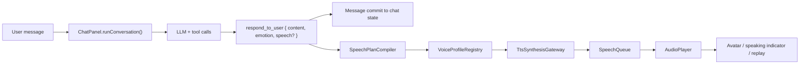

# Chat TTS Architecture Design

## Goal

Add TTS playback for the main model's chat responses in a way that keeps:

- the **spoken wording** aligned with what appears in the chat bubble
- the **voice identity** aligned with the active character
- the **speaking style / prosody** aligned with the character's tone and the per-message emotion
- latency low enough that speech feels attached to the chat, not like a separate feature

The most important rule is:

> The system must never generate a second, paraphrased "speech-only" answer.

The chat message is the source of truth. TTS is a rendering layer for that message.

## Relevant Existing Integration Points

This repo already has the right anchors for a clean implementation:

- `apps/webuiapps/src/components/ChatPanel/index.tsx`
  - `getRespondToUserToolDef()` defines the assistant's final reply contract.
  - the `respond_to_user` handler is where the UI message is committed.
  - `renderMessageContent()` already distinguishes clickable links and parenthetical action text.
- `apps/webuiapps/src/lib/characterManager.ts`
  - already stores character persona, emotion list, and emotion media
  - is the natural place to store per-character voice metadata
- `apps/webuiapps/src/lib/llmClient.ts`
  - currently uses `stream: false`
  - means the clean first version is "speak after `respond_to_user` lands"

This means we do **not** need a separate "speech model." We need a **speech rendering pipeline**.

## Non-Negotiable Design Rules

### 1. Single transcript source

The text displayed in chat must be the canonical transcript for TTS.

- Good: synthesize from `respond_to_user.character_expression.content`
- Bad: ask another model to rewrite the answer for speech

### 2. Voice is attached to the character, not the message

The active character owns the base voice identity.

- message-level emotion can modulate rate, pitch, energy, and pauses
- message-level emotion must not swap to an entirely different voice

### 3. Style metadata can exist, but only as rendering hints

The assistant may emit speech directives, but those directives can only describe **how** to say the line.

They must not replace the original line with new wording.

### 4. Deterministic text-to-speech normalization only

We can transform the bubble into a spoken plan only through deterministic rules such as:

- stripping Markdown URL syntax while preserving the visible label
- converting parenthetical action markers into silent stage directions
- applying pronunciation hints for names / acronyms

We should not run a second generative rewrite step.

## Proposed Architecture



## Main Components

### 1. `respond_to_user` remains the final reply contract

Extend the tool schema so the assistant can provide speech hints together with the final visible message.

Suggested shape:

```ts
interface RespondToUserPayload {
  character_expression: {
    content: string;
    emotion?: string;
  };
  speech?: {
    rate?: number; // 0.85 - 1.15
    pitch?: number; // relative
    energy?: number; // 0 - 1
    pause_ms_after_clauses?: number;
    pronunciation_hints?: Array<{
      text: string;
      spoken_as: string;
    }>;
    emphasis_phrases?: string[];
    style_tags?: string[]; // e.g. ['casual', 'teasing', 'soft']
    speak_stage_directions?: boolean; // default false
  };
  user_interaction?: {
    suggested_replies?: string[];
  };
}
```

Important:

- `speech.spoken_text` is intentionally omitted
- `character_expression.content` is the only semantic transcript

### 2. `VoiceProfileRegistry`

Store the character's voice identity in `characterManager.ts`.

Suggested addition:

```ts
interface CharacterVoiceProfile {
  provider: 'minimax' | 'openai' | 'azure' | 'elevenlabs' | 'custom';
  voice_id: string;
  reference_audio_url?: string;
  base_style_prompt?: string;
  default_rate?: number;
  default_pitch?: number;
  default_energy?: number;
  pronunciation_lexicon?: Array<{
    text: string;
    spoken_as: string;
  }>;
  emotion_overrides?: Record<
    string,
    {
      rate?: number;
      pitch?: number;
      energy?: number;
      style_tags?: string[];
    }
  >;
  language_overrides?: Partial<
    Record<
      'ko' | 'en' | 'ja' | 'zh',
      {
        voice_id?: string;
        base_style_prompt?: string;
      }
    >
  >;
}
```

Attach this under `character_meta_info`, for example:

```ts
character_meta_info: {
  ...
  voice_profile: { ... }
}
```

Why this matters:

- the repo already binds persona + emotion media to the active character
- voice identity should live in the same place as the rest of the character identity

### 3. `SpeechPlanCompiler`

Add a deterministic compiler that converts the chat bubble into a spoken plan.

Suggested new module:

- `apps/webuiapps/src/lib/speechPlan.ts`

Input:

- `content`
- `emotion`
- `speech` hints
- `voice_profile`

Output:

```ts
interface SpeechPlan {
  transcript: string; // exact chat content
  segments: SpeechSegment[];
  providerPayload: Record<string, unknown>;
  cacheKey: string;
}

interface SpeechSegment {
  kind: 'spoken' | 'stage' | 'pause';
  rawText: string;
  spokenText?: string;
  durationMs?: number;
}
```

Compiler rules:

1. Plain dialogue is spoken verbatim.
2. Markdown links like `[label](url)` speak only `label`.
3. Bare URLs are either skipped or replaced by a short phrase like "link" based on product choice.
4. Parenthetical action markers like `(smiles)` or `(leans closer)` are treated as `stage` segments by default.
5. `stage` segments modify prosody or add pauses, but are not read aloud unless explicitly enabled.

This lines up with the existing UI behavior in `renderMessageContent()`, which already treats parenthetical spans as a separate emotional/action layer.

### 4. `TtsSynthesisGateway`

Add a provider-agnostic synthesis layer:

- `apps/webuiapps/src/lib/ttsClient.ts`

Responsibilities:

- call a local backend endpoint such as `/api/tts/synthesize`
- keep API keys off the browser
- normalize provider-specific request / response formats
- return either:
  - an audio URL
  - an `ArrayBuffer`
  - or a streaming audio source

Suggested backend endpoints in `apps/webuiapps/vite.config.ts`:

- `POST /api/tts/synthesize`
- `POST /api/tts/prewarm`
- `POST /api/tts/stop`

The backend should also own:

- short-lived audio cache
- provider retries / timeouts
- optional voice-clone asset management

### 5. `SpeechQueue`

Add a queue controller in the browser:

- `apps/webuiapps/src/lib/speechQueue.ts`

Responsibilities:

- enqueue assistant messages after they are committed to the UI
- keep only one active utterance per chat session
- interrupt current speech when:
  - the user sends a new message
  - the user manually stops playback
  - a higher-priority system notice should preempt the queue
- support replay from message history

Suggested policy:

- user message immediately interrupts current assistant playback
- assistant messages generated from reminders / automations are enqueued normally

### 6. `AudioPlayer`

Add a small playback layer:

- `apps/webuiapps/src/lib/audioPlayer.ts`

Responsibilities:

- play synthesized audio
- expose `playing`, `paused`, `messageId`, and `progress`
- feed UI state for:
  - a "speaking" indicator
  - replay button per assistant bubble
  - avatar animation hooks

## Recommended Data Flow in This Repo

### Phase 1: response-complete TTS

This matches the current implementation best because `llmClient.ts` is not streaming.

1. `runConversation()` receives the tool result.
2. `respond_to_user` handler commits the assistant bubble to `messages`.
3. the same handler creates a `SpeechPlan`.
4. the plan is sent to `/api/tts/synthesize`.
5. returned audio is enqueued and played.

This is the lowest-risk first version because the text is already final when we start synthesis.

### Phase 2: sentence-level streaming TTS

If later we move `llmClient.ts` to token streaming, add a sentence-commit protocol instead of speaking raw partial text.

Do this with a committed chunk model:

- `respond_to_user_start`
- `respond_to_user_delta`
- `respond_to_user_commit_sentence`
- `respond_to_user_end`

Rules:

- only synthesize fully committed sentences
- never synthesize text that might still be edited by the model
- if the tail changes, cancel only the unsynthesized remainder

This keeps the spoken result aligned with the final bubble even under streaming.

## Why This Preserves Voice and Speaking Style

There are three separate layers, and each one has a clear owner:

### Layer 1. Wording / persona

Owned by the main model through `respond_to_user.character_expression.content`.

This is where the chat bubble's actual phrasing, tone, flirting level, bluntness, and language choice come from.

### Layer 2. Emotional delivery

Owned by:

- `character_expression.emotion`
- optional `speech` directives
- character-level emotion defaults in `voice_profile.emotion_overrides`

This controls how the line is performed without changing the line itself.

### Layer 3. Voice identity

Owned by `character.character_meta_info.voice_profile`.

This keeps the speaker stable across turns.

That split prevents the most common failure mode:

> chat text sounds like one character, but TTS sounds like a different narrator.

## Text Equivalence Policy

To satisfy "the voice and speaking style must match the chat content," define a strict equivalence policy:

- The stored transcript is the exact bubble text.
- The spoken transcript must be derivable from the bubble through deterministic rendering rules only.
- No semantic additions, deletions, or paraphrases.

Examples:

| Bubble text | Spoken result |
| --- | --- |
| `Let's go.` | `Let's go.` |
| `(smiles) Let's go.` | `Let's go.` with warm / upbeat prosody |
| `Read [this note](https://...)` | `Read this note.` |
| `Open https://example.com` | `Open link.` or skip URL based on product rule |

This gives us natural speech without breaking transcript fidelity.

## Suggested UI / UX Additions

### Chat bubble controls

For assistant messages:

- play / replay button
- stop button when active
- subtle speaking indicator

### Global settings

Add a TTS section to settings:

- enable / disable auto-play
- output device
- interrupt on user input
- speech speed multiplier

### Character editor

Extend `CharacterPanel.tsx` so each character can define:

- voice provider
- voice id / reference sample
- default style prompt
- pronunciation lexicon
- per-emotion delivery tuning

## File-Level Implementation Plan

### New files

- `apps/webuiapps/src/lib/speechPlan.ts`
- `apps/webuiapps/src/lib/ttsClient.ts`
- `apps/webuiapps/src/lib/speechQueue.ts`
- `apps/webuiapps/src/lib/audioPlayer.ts`
- `apps/webuiapps/src/lib/ttsTypes.ts`

### Existing files to extend

- `apps/webuiapps/src/lib/characterManager.ts`
  - add `voice_profile` types
- `apps/webuiapps/src/components/ChatPanel/index.tsx`
  - extend `respond_to_user` tool schema with `speech`
  - enqueue speech after message commit
  - add replay / speaking UI
- `apps/webuiapps/src/components/ChatPanel/CharacterPanel.tsx`
  - edit voice settings
- `apps/webuiapps/vite.config.ts`
  - add `/api/tts/*` endpoints / proxy

## Caching Strategy

Cache key should include:

- character id
- voice profile version or hash
- final content text
- emotion
- normalized speech directives
- target language

This enables:

- instant replay
- cheap repeated lines such as reminders or recurring catchphrases

Do not cache across different voice profiles even if the text is the same.

## Failure Handling

If TTS fails:

- keep the chat message visible
- show a small non-blocking "speech unavailable" state
- allow manual retry
- never block the conversation loop on audio failure

If synthesis is slow:

- commit the bubble immediately
- start playback when ready
- optionally show a small "preparing audio" indicator

## Observability

Log per utterance:

- message id
- character id
- voice id
- synth latency
- audio duration
- cache hit / miss
- failure reason

This will make voice-mismatch and latency regressions much easier to debug.

## Testing Strategy

### Unit tests

- `render bubble -> speech plan` conversion
- parenthetical action handling
- pronunciation lexicon merge order
- cache key stability

### Integration tests

- `respond_to_user` with `emotion` enqueues one utterance
- user send interrupts current playback
- replay uses cached synthesis when available

### Contract tests

- assistant tool schema accepts `speech`
- providers receive deterministic payloads for the same input

## Provider-Specific API Layer

For this repo, the cleanest implementation is to expose one internal backend contract and map providers behind it.

### Internal backend contract

Frontend should only call local endpoints:

- `POST /api/tts/synthesize`
- `POST /api/tts/synthesize-with-timing`
- `POST /api/tts/voices`
- `POST /api/tts/stop`

Suggested request shape:

```ts
interface InternalTtsRequest {
  provider: 'google-cloud' | 'elevenlabs';
  messageId: string;
  sessionPath: string;
  transcript: string;
  languageCode?: string; // e.g. ko-KR, en-US
  emotion?: string;
  voiceProfile: {
    voiceId: string;
    model?: string;
    settings?: Record<string, unknown>;
    stylePrompt?: string;
    pronunciationHints?: Array<{
      text: string;
      spokenAs: string;
    }>;
  };
  playback: {
    format: 'mp3' | 'pcm' | 'ogg_opus';
    withTiming?: boolean;
    stream?: boolean;
  };
}
```

Suggested normalized response:

```ts
interface InternalTtsResponse {
  providerRequestId?: string;
  audioBase64?: string;
  audioUrl?: string;
  mimeType: string;
  sampleRateHz?: number;
  alignment?: {
    characters: string[];
    startMs: number[];
    endMs: number[];
  };
  cacheHit: boolean;
}
```

This keeps the browser independent from provider-specific auth, request shapes, and streaming quirks.

### Google 1안: Cloud Text-to-Speech API

Use Google Cloud TTS as the primary provider for this app.

Why this is the best fit:

- Google's Gemini-TTS in Cloud TTS supports separate `prompt` and `text` fields
- Cloud TTS also gives a cleaner path to Chirp 3 HD when we want streaming
- the official docs explicitly note that Cloud TTS is the better choice if we need multiple request / multiple response style streaming

Recommended backend adapter split:

- `GoogleGeminiTtsAdapter`
  - default for final bubble playback
  - high controllability
  - best for "exact text + style prompt" separation
- `GoogleChirpTtsAdapter`
  - optional fast path for streamed sentence playback later
  - best when we move to low-latency chunked synthesis

Suggested backend files:

- `apps/webuiapps/src/lib/tts/googleGeminiTts.ts`
- `apps/webuiapps/src/lib/tts/googleChirpTts.ts`

#### Google Gemini-TTS request mapping

Recommended mapping:

- `transcript` -> Cloud TTS `text`
- `voiceProfile.stylePrompt` + emotion-derived delivery hints -> Cloud TTS `prompt`
- `voiceProfile.voiceId` -> selected prebuilt voice

Important design rule:

- never build one giant prompt string that mixes directions and transcript together if we are using Cloud TTS
- keep transcript in the actual text field whenever the API supports it

Server-side pseudocode:

```ts
const googleRequest = {
  input: {
    text: request.transcript,
    prompt: buildStylePrompt(request),
  },
  voice: {
    languageCode: request.languageCode ?? 'ko-KR',
    name: request.voiceProfile.voiceId,
  },
  audioConfig: {
    audioEncoding: mapEncoding(request.playback.format),
  },
};
```

Use this for:

- default assistant playback
- replay
- stable cached synthesis

#### Google Chirp 3 HD request mapping

Use Chirp 3 HD later if we want lower-latency sentence-by-sentence playback.

Recommended mapping:

- `transcript` -> plain text or SSML input
- `emotion` -> speaking rate / selected voice / optional SSML shaping
- pronunciation hints -> SSML `<say-as>` or a deterministic pre-normalization step

Server-side pseudocode:

```ts
const chirpRequest = {
  input: {
    text: compilePlainSpeechText(request),
  },
  voice: {
    languageCode: request.languageCode ?? 'ko-KR',
    name: request.voiceProfile.voiceId,
  },
  audioConfig: {
    audioEncoding: mapEncoding(request.playback.format),
    speakingRate: resolveSpeakingRate(request),
  },
};
```

When we later need streaming, Chirp is the provider path to prefer before adding complicated browser-side chunk stitching.

### ElevenLabs 2안: fallback / premium character provider

Use ElevenLabs as a secondary provider when:

- we need instant voice cloning quickly
- a character's unique timbre matters more than strict transcript-vs-direction separation elegance
- we want timing metadata from the TTS endpoint for lip-sync / cursor sync

Suggested backend file:

- `apps/webuiapps/src/lib/tts/elevenLabsTts.ts`

#### ElevenLabs request mapping

Recommended endpoint choices:

- normal playback: `POST /v1/text-to-speech/{voice_id}`
- playback with alignment: `POST /v1/text-to-speech/{voice_id}/with-timestamps`
- streamed chunk playback later: `STREAM /v1/text-to-speech/{voice_id}/stream` or websocket

Server-side pseudocode:

```ts
const elevenRequest = {
  text: request.transcript,
  model_id: request.voiceProfile.model ?? 'eleven_flash_v2_5',
  language_code: toElevenLanguageCode(request.languageCode),
  voice_settings: {
    stability: resolveStability(request),
    similarity_boost: resolveSimilarityBoost(request),
    style: resolveStyle(request),
    speed: resolveSpeed(request),
    use_speaker_boost: true,
  },
  pronunciation_dictionary_locators: resolvePronunciationDictionaries(request),
};
```

Important limitation relative to Google:

- ElevenLabs style control is excellent, but conceptually more intertwined with the voice model and per-request settings
- for this app's architecture, that makes transcript fidelity slightly harder to reason about than Google Gemini-TTS's explicit `prompt` + `text` split

That is why ElevenLabs is better treated as:

- a premium character-voice provider
- not the default contract the rest of the app depends on

### Recommended implementation order

#### Phase A

- ship only `google-cloud` provider
- default to Gemini-TTS for final bubble playback
- keep ElevenLabs adapter stubbed behind the same interface

#### Phase B

- add ElevenLabs provider support
- allow per-character voice selection in `CharacterPanel`
- use ElevenLabs only for characters that explicitly opt into custom voice cloning or premium timbre

#### Phase C

- if streaming becomes critical, test Chirp 3 HD and ElevenLabs stream mode side by side
- keep the frontend contract unchanged while swapping the backend adapter per character / scenario

### Concrete recommendation for this repo

If we implement only one provider first, implement:

1. `GoogleGeminiTtsAdapter`
2. internal `/api/tts/synthesize`
3. deterministic speech-plan compiler
4. cached replay

If we implement a second provider, add:

1. `ElevenLabsTtsAdapter`
2. optional `/api/tts/synthesize-with-timing`
3. per-character provider override in `voice_profile`

## Rollout Plan

### Step 1. Stable non-streaming TTS

- add voice profile to characters
- add deterministic speech-plan compiler
- speak after `respond_to_user`

### Step 2. UI controls and replay

- per-message replay
- stop / interrupt behavior
- TTS settings panel

### Step 3. Streaming optimization

- only after the non-streaming path is stable
- move to sentence-commit streaming, not raw token streaming

## Final Recommendation

For this repo, the best architecture is:

1. keep `respond_to_user` as the single source of truth for visible speech
2. store a stable voice profile on the character
3. compile the bubble into a deterministic speech plan
4. synthesize through a backend gateway
5. queue playback separately from the conversation loop

That structure gives the strongest guarantee that the spoken output will feel like the same character saying the same line the user sees on screen.
