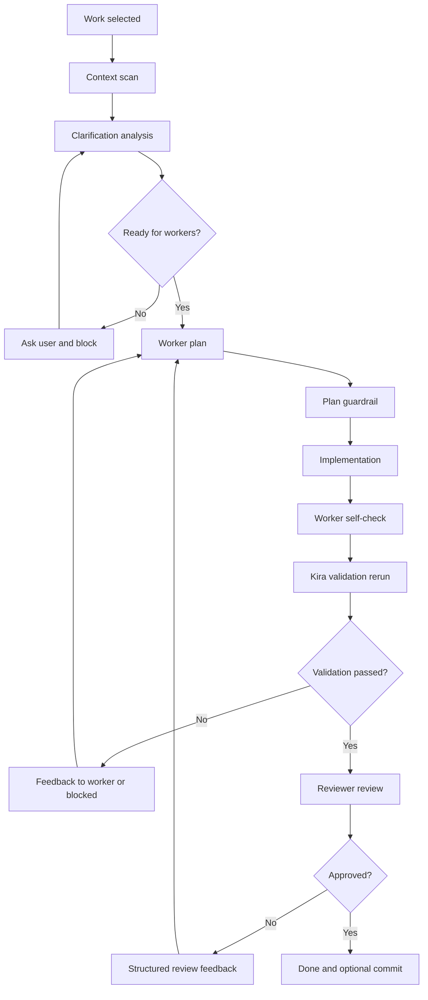

# Kira 워커/리뷰어 Codex급 고도화 계획

## 1. 목표

Kira의 자동 처리 과정을 Codex 수준에 가깝게 끌어올린다. 여기서 Codex급은 단순히 모델 성능을 높이는
뜻이 아니라, 작업을 맡은 에이전트가 저장소를 충분히 이해하고, 좁은 범위로 안전하게 수정하며, 검증과
리뷰를 반복해 실제 병합 가능한 결과를 남기는 운영 품질을 의미한다.

핵심 목표는 다음 네 가지다.

1. 메인 오케스트레이션 모델이 일감 brief를 먼저 분석해 모호한 요구사항은 worker 배정 전에 사용자에게
   clarification 질문으로 확인한다.
2. 워커가 구현 전에 저장소 구조, 기존 패턴, 위험 파일, 테스트 경로를 먼저 파악한다.
3. 워커가 계획, 수정, 검증, 요약을 명확한 산출물로 남긴다.
4. 리뷰어가 diff만 보는 얕은 승인자가 아니라 회귀 위험, 테스트 누락, 요구사항 미충족을 잡는 독립
   검토자가 된다.
5. 반복 실패, 범위 이탈, 미검증 변경은 자동으로 중단하거나 사람에게 넘긴다.

## 2. 현재 출발점

현재 Kira에는 Codex급 처리 흐름의 초석이 이미 있다.

- 작업은 `todo`, `in_progress`, `in_review`, `blocked`, `done` 상태로 관리된다.
- `todo` 일감은 worker 배정 전에 clarification 분석을 거치며, 모호한 brief는 `blocked` 상태와 질문
  목록으로 사용자 답변을 기다린다.
- 사용자가 clarification 에 답하면 답변이 work item 상태와 Markdown 설명에 저장되고, 일감은 다시
  `todo` 로 돌아가 worker 배정을 재개한다.
- 워커와 리뷰어가 분리되어 있으며, 최대 리뷰 사이클을 반복한다.
- 워커는 실행 계획, 변경 파일, 실행한 검사, 남은 위험을 요약한다.
- Kira가 계획된 검증 명령과 자동 추가 검증 명령을 다시 실행한다.
- 고위험 검증 실패, 반복되는 리뷰 이슈, 반복되는 검증 실패는 `blocked`로 전환된다.
- 승인된 작업은 설정에 따라 자동 커밋까지 시도한다.

따라서 고도화의 방향은 기존 구조를 유지하면서 각 단계의 판단력, 도구 사용성, 관측 가능성, 안전장치를
강화하는 것이다.

## 3. Codex급 기준

### 3.1 워커 기준

워커는 다음 행동을 기본값으로 가져야 한다.

- 구현 전 저장소 탐색을 수행한다.
- `rg`, 파일 읽기, 테스트 스크립트 확인, 관련 심볼 추적을 통해 최소한의 작업 범위를 정한다.
- 사용자 변경사항과 기존 dirty worktree를 보존한다.
- 수정 전 계획에 의도한 파일, 검증 명령, 위험 요소를 적는다.
- 계획 밖 파일을 만질 경우 이유를 남기고, 위험도가 높으면 중단한다.
- 검증을 직접 실행하고 실패 원인을 요약한다.
- 최종 요약에는 변경 내용, 변경 파일, 실행한 검사, 남은 리스크가 반드시 포함된다.

### 3.2 리뷰어 기준

리뷰어는 다음 행동을 기본값으로 가져야 한다.

- 요구사항, 워커 계획, 실제 diff, 검증 결과를 함께 본다.
- 기능 회귀, 데이터 손상, 보안 위험, 테스트 누락을 우선순위로 판단한다.
- 스타일 취향보다 실제 버그와 운영 위험을 먼저 다룬다.
- 승인 또는 반려 사유를 구조화해 다음 워커 시도가 바로 사용할 수 있게 한다.
- 검증이 부족하면 승인하지 않고 필요한 명령을 명시한다.
- 같은 문제가 반복되면 추가 시도보다 `blocked` 전환을 권한다.

## 4. 목표 처리 파이프라인



## 5. 단계별 개선 계획

### 5.0 0단계: worker 배정 전 clarification

구현 상태: worker 배정 전 clarification 분석은 구현 완료. 질문 품질 개선과 사용자 답변 UI 확장은
후속 개선으로 남긴다.

#### 구현한 것

- `todo` 상태의 work item은 worker 실행 전에 title, description, projectName을 해시한 brief 기준으로
  clarification 분석을 수행한다.
- 분석은 메인 Kira 오케스트레이션 역할의 프롬프트로 실행되며, worker가 잘못된 방향으로 구현할
  가능성이 큰 경우에만 사용자에게 질문하도록 지시한다.
- 가능한 경우 2-4개 객관식 option을 포함하고, 필요하면 custom answer를 허용한다.
- clarification 이 필요하면 work item은 `blocked`가 되고 `clarification.status = "pending"` 과 질문
  목록을 저장한다.
- 사용자가 답변하면 `clarification.status = "answered"` 로 바뀌고, 답변은 work description 끝의
  `Clarification Answers` 섹션에 idempotent 하게 반영된다.
- brief가 그대로이고 이미 `answered` 또는 `cleared` 상태라면 같은 질문을 반복하지 않는다.
- 저장된 pending clarification에 usable question이 없으면 fallback 질문을 만들어 UI가 답변 불가능한
  상태에 빠지지 않게 한다.

#### 남은 것

- 질문 품질을 점수화하거나, 너무 사소한 질문을 자동 제거하는 별도 평가 단계는 없다.
- 사용자가 답변 대신 brief 자체를 수정했을 때 이전 답변 섹션을 어떻게 보존할지에 대한 세밀한 정책은
  아직 단순하다.
- clarification 질문/답변의 한국어/영어 로컬라이징은 UI 텍스트 중심이고, 모델이 생성한 질문 언어는
  brief 언어를 따르도록 프롬프트로 유도한다.

완료 기준:

- 완료: worker 배정 전에 모호한 work item을 차단하고 사용자에게 질문한다.
- 완료: 사용자 답변 후 work item이 다시 `todo` 로 돌아가 자동화가 재개된다.
- 완료: 같은 brief에 대해 이미 정리된 clarification은 반복 질문하지 않는다.
- 완료: malformed pending clarification이 UI dead-end를 만들지 않는다.

### 5.1 1단계: 컨텍스트 스캔 강화

워커 실행 전에 Kira가 프로젝트의 기본 정보를 수집해 프롬프트에 주입한다.

구현 상태: 5.1 범위의 런타임 컨텍스트 스캔은 구현 완료. 구조화 저장과 더 엄격한 계획 계약은 5.2
이후로 이월한다.

#### 구현한 것

현재 Kira는 워커 계획 전에 `ProjectContextScan`을 생성한다.

구현된 수집 항목:

- `Project context`: 프로젝트 루트와 감지된 패키지 매니저
- `Workspace/config files`: `package.json`, workspace 설정, Vite/Vitest/TS/Python/Go/Rust/.NET 설정
  파일
- `Important package scripts`: `test`, `lint`, `build`, `typecheck`, `check`
- `Existing changes`: `git status --porcelain=v1 -uall` 기반 기존 변경사항
- `Search terms from brief`: 작업 제목과 설명에서 추출한 파일 경로, 디렉터리, 심볼 후보
- `Likely files`: 검색어 기반 파일명/본문 매치
- `Related docs`: 작업과 관련된 Markdown/Text 문서 후보, 없으면 README/가이드성 문서 후보
- `Related tests`: `__tests__`, `tests`, `.test.*`, `.spec.*` 경로 후보
- `Candidate checks`: 프로젝트와 스크립트 기반 검증 명령 후보
- `Context notes`: 기존 변경 보존, 검증 후보 없음, 관련 파일/테스트 후보 없음 같은 주의사항

구현된 주입 경로:

- 워커 계획 프롬프트에 컨텍스트 스캔 결과를 주입한다.
- 워커 실행 프롬프트에 같은 컨텍스트 스캔 결과를 주입한다.
- 리뷰어 프롬프트에 같은 컨텍스트 스캔 결과를 주입한다.
- 완료된 워커 attempt 댓글에 `Project context`, `Existing changes`, `Likely files`,
  `Candidate checks`, `Preflight exploration`을 기록한다.

구현된 게이트 동작:

- 프리플라이트 플래너는 계획 전에 `list_files`, `search_files`, `read_file` 중 하나 이상을 사용해야
  한다.
- 탐색 기록이 없으면 `Preflight planning requested more context` 댓글을 남기고 구현을 시작하지
  않는다.
- 스캔에서 관련 파일 후보가 없고 플래너도 탐색하지 않았으면 재계획을 요구한다.
- 계획이 `intendedFiles`를 하나도 제시하지 않으면 구현 단계로 넘어가지 않는다.

테스트로 확인한 것:

- `ProjectContextScan`이 scripts, 관련 파일, 관련 문서, 관련 테스트, 후보 검증 명령을 수집한다.
- `openVscodeTsLanguageService` 테스트의 Windows 경로 구분자 문제를 수정했다.
- Kira 자동화 단위 테스트, TS language service 단위 테스트, 전체 앱 테스트, test build가 통과한다.

#### 남은 것

5.1의 런타임 스캔은 동작하지만, 다음 항목은 아직 별도 구조로 완성하지 않았다.

- 스캔 결과를 `attempts/{workId}-{attemptNo}.json` 같은 구조화 파일로 저장하지 않는다. 현재는
  프롬프트와 댓글 중심이다.
- `readFiles`, `searchedTerms`, `listedDirectories` 같은 탐색 기록이 독립 필드로 저장되지 않는다.
  현재는 `Preflight exploration` 텍스트로 남는다.
- 프리플라이트 계획 JSON에 `repoFindings`, `protectedFiles`, `stopConditions`가 강제되지 않는다.
  이는 5.2 워커 계획 계약 강화 범위다.
- dirty worktree와 계획 파일의 충돌을 hard-block하지 않는다. 현재는 컨텍스트와 주의사항으로
  제공한다.
- 관련 파일 후보가 약한 경우 재탐색은 요구하지만, 탐색 품질을 점수화하지는 않는다.
- UI에 컨텍스트 스캔을 별도 섹션이나 timeline으로 보여주지 않는다. 현재는 댓글에서 확인한다.

#### 다음 단계로 넘길 것

- 5.2에서 워커 계획 JSON 계약에 `repoFindings`, `protectedFiles`, `stopConditions`를 추가하고
  파싱/게이트를 강화한다.
- 5.2 또는 5.7에서 컨텍스트 스캔과 프리플라이트 탐색 기록을 `attempts` 데이터 모델로 분리한다.
- 5.6에서 dirty worktree 보호를 soft warning에서 hard guardrail로 끌어올린다.

완료 기준:

- 완료: 모든 워커 시도에 `Project context`, `Existing changes`, `Likely files`, `Candidate checks`
  섹션이 포함된다.
- 완료: 관련 파일 후보가 없으면 워커가 먼저 탐색 작업을 수행한다.
- 완료: 관련 문서와 테스트 파일 후보가 컨텍스트 스캔에 포함된다.
- 완료: 탐색 없는 프리플라이트 계획은 구현 단계로 넘어가지 않는다.
- 이월: 컨텍스트 스캔을 구조화 attempt 파일로 저장한다.
- 이월: dirty worktree 충돌을 명시적 guardrail로 막는다.

검증 결과:

- `pnpm --dir apps/webuiapps exec vitest run src/lib/__tests__/kiraAutomationPlugin.test.ts`
- `pnpm --dir apps/webuiapps exec vitest run src/lib/__tests__/openVscodeTsLanguageService.test.ts`
- `pnpm --dir apps/webuiapps test`
- `pnpm --dir apps/webuiapps run build:test`

### 5.2 2단계: 워커 계획 계약 고정

현재 워커 계획을 더 엄격한 JSON 계약으로 고정한다.

구현 상태: 5.2 범위의 워커 계획 계약은 구현 완료. 계획 품질 점수화와 UI 기반 계획 편집은 후속
개선으로 남긴다.

#### 구현한 것

워커 계획 JSON 계약에 다음 필드를 고정했다.

- `understanding`: 요구사항을 워커가 어떻게 이해했는지
- `repoFindings`: 확인한 기존 패턴과 근거 파일
- `intendedFiles`: 수정 예정 파일
- `protectedFiles`: 건드리지 않을 사용자 변경 파일
- `validationCommands`: 실행할 검증 명령
- `riskNotes`: 예상 위험과 완화 방법
- `stopConditions`: 중단해야 하는 조건

구현된 파싱/게이트 동작:

- `parseWorkerExecutionPlan`이 계획 JSON을 파싱하고 `valid`, `parseIssues`를 함께 반환한다.
- 필수 필드가 비어 있거나 타입이 맞지 않으면 구현 단계로 넘어가지 않고 재계획을 요구한다.
- `intendedFiles`가 비어 있으면 구현을 시작하지 않는다.
- `protectedFiles`와 `intendedFiles`가 겹치면 충돌로 판단해 구현을 중단한다.
- 계획 파싱 실패, 필수 필드 누락, 탐색 부족은 attempt 기록에 `needs_context` 상태로 저장된다.
- 워커 실행 프롬프트와 attempt 댓글에 `understanding`, `repoFindings`, `protectedFiles`,
  `stopConditions`가 포함된다.

#### 남은 것

- 계획의 “좋음”을 점수화하지는 않는다. 현재는 필수 구조와 위험 충돌을 hard gate로 막는다.
- UI에서 계획 JSON을 사람이 직접 수정해 재시도하는 기능은 없다.
- `intendedFiles`가 지나치게 넓은지 여부는 완전 자동 판정하지 않는다.

완료 기준:

- 완료: 계획 JSON 파싱 실패 시 구현 단계로 넘어가지 않는다.
- 완료: `intendedFiles`가 비어 있으면 재계획을 요구한다.
- 완료: `protectedFiles`와 `intendedFiles` 충돌은 구현 전에 차단한다.
- 완료: dirty worktree와 충돌하는 파일은 `intendedFiles`에 포함되지 않으면 수정할 수 없다.
- 이월: 계획 품질 점수화와 사람이 편집 가능한 계획 UI를 추가한다.

### 5.3 3단계: 도구 사용 모델 개선

Codex급 워커는 텍스트 답변만으로 작업하지 않는다. 필요한 도구를 실제로 사용해 근거를 쌓아야 한다.

구현 상태: 5.3 범위의 핵심 도구 사용 기록은 구현 완료. 개별 tool call의 상세 원문 로그는 후속
개선으로 남긴다.

#### 구현한 것

기록되는 도구 사용 항목:

- `explorationActions`: 계획 전 `list_files`, `search_files`, `read_file` 사용 기록
- `readFiles`: 워커가 읽은 파일 목록
- `patchedFiles`: 워커가 `write_file`, `edit_file`로 실제 수정한 파일 목록
- `commandsRun`: 워커가 실행한 명령과 exit code, stdout/stderr 요약
- `validationReruns`: Kira가 다시 실행한 검증 결과

구현된 보호 동작:

- 파일 쓰기 전에 `validateWriteTarget`이 `protectedFiles`와 dirty 파일 충돌을 확인한다.
- 워커가 수정한 파일은 `recordAttemptPatch`로 attempt 상태에 즉시 기록된다.
- attempt 댓글과 구조화 attempt 파일에 읽은 파일, 수정 파일, 실행 명령, 검증 재실행 결과가 남는다.
- shell 실행 결과는 exit code와 stdout/stderr 중심으로 구조화된다.

#### 남은 것

- 개별 tool call 전체 원문과 입력 파라미터를 별도 timeline 이벤트로 저장하지는 않는다.
- 읽지 않은 파일을 수정한 경우 리뷰어에게 별도 경고 문구를 자동 생성하는 로직은 아직 약하다. 현재는
  `readFiles`와 `patchedFiles`를 함께 노출해 리뷰어가 비교할 수 있게 한다.
- 긴 파일 excerpt 최적화는 모델 도구 구현에 의존하며, Kira attempt 모델에서 별도 관리하지 않는다.

완료 기준:

- 완료: 워커 요약과 attempt 기록에 `readFiles`, `patchedFiles`, `commandsRun`이 남는다.
- 완료: 파일 쓰기는 계획/보호 파일 guardrail을 통과해야 한다.
- 완료: shell 실행 결과는 exit code와 stdout/stderr 중심으로 구조화된다.
- 이월: tool call 단위 timeline과 읽지 않은 파일 수정 자동 경고를 강화한다.

### 5.4 4단계: 검증 전략 자동 보강

현재 Kira는 계획된 검증과 자동 추가 검증을 재실행한다. 여기에 변경 파일 기반 검증 선택을 더한다.

구현 상태: 5.4 범위의 기본 변경 파일 기반 검증 보강은 구현 완료. 프레임워크별 세부 매핑은 점진적으로
확장한다.

#### 구현한 것

검증 명령 선택:

- 패키지 매니저를 감지해 `pnpm`, `npm`, `yarn` 기반 명령 후보를 만든다.
- `package.json`의 `test`, `lint`, `build`, `typecheck`, `check` 스크립트를 후보로 수집한다.
- 변경 파일이 `.test.*` 또는 `.spec.*`이면 해당 테스트 파일을 직접 실행하는 `vitest` 명령을 우선
  제안한다.
- 문서만 변경된 경우 검증 생략 사유를 `validationPlan.notes`에 남긴다.
- 검증 후보가 없으면 “안전하게 추론 가능한 검증 없음”을 명시한다.

실패 처리:

- 워커 계획 검증과 Kira 자동 보강 검증을 함께 재실행한다.
- 실패한 검증 결과는 다음 워커 시도 프롬프트에 축약되어 들어간다.
- 같은 검증 실패 signature가 두 번 반복되면 작업을 `blocked`로 전환한다.
- 검증 실패와 반복 차단 상태가 attempt 파일에 저장된다.

#### 남은 것

- 모든 프레임워크의 테스트 러너를 완전 자동 매핑하지는 않는다.
- Markdown 링크 검사나 문서 린터는 아직 기본 명령으로 추가하지 않는다.
- 설정 파일별 맞춤 검증은 현재 package script 후보에 의존한다.

완료 기준:

- 완료: 변경 파일 유형에 따라 합리적 검증 또는 명시적 생략 사유가 남는다.
- 완료: 테스트 파일 변경은 해당 테스트 파일 직접 실행 후보를 만든다.
- 완료: 실패한 검증은 다음 워커 프롬프트에 축약된 실패 원인으로 들어간다.
- 완료: 같은 검증 실패가 두 번 반복되면 자동 재시도 대신 `blocked`로 전환한다.
- 이월: Markdown 링크 검사와 프레임워크별 맞춤 검증 매핑을 확장한다.

### 5.5 5단계: 리뷰어 독립성 강화

리뷰어는 워커의 요약을 신뢰하되, 그것만 근거로 승인하지 않는다.

구현 상태: 5.5 범위의 구조화 리뷰 계약과 승인 gate는 구현 완료. 라인 기반 UI 표시와 리뷰 품질 채점은
후속 개선으로 남긴다.

#### 구현한 것

리뷰 입력에 포함되는 정보:

- 원래 작업 설명
- 워커 계획과 컨텍스트 스캔
- 실제 git diff excerpt
- 변경 파일 목록과 계획 밖 변경
- Kira 재실행 검증 결과
- 반복 이슈 이력과 이전 리뷰 피드백

리뷰 출력 계약:

- `approved`: 승인 여부
- `summary`: 한 단락 요약
- `findings`: 파일, 라인, 심각도, 설명
- `missingValidation`: 추가로 필요한 검증
- `nextWorkerInstructions`: 다음 시도에 바로 넣을 지시
- `residualRisk`: 승인하더라도 남는 위험

구현된 승인 gate:

- `findings`가 있으면 `approved`를 false로 강제한다.
- `missingValidation`이 있으면 `approved`를 false로 강제한다.
- 검증 실패가 있는 상태에서는 리뷰 단계로 넘어가기 전에 워커 재시도 또는 blocked 처리가 우선된다.
- 리뷰 결과는 `reviews/{workId}-{attemptNo}.json`에 저장된다.
- 반려 시 다음 워커 피드백은 `nextWorkerInstructions`를 우선 사용한다.

#### 남은 것

- 리뷰 finding의 라인 번호는 리뷰어가 제공한 값에 의존한다.
- Kira UI에서 finding을 코드 라인에 직접 인라인 표시하지는 않는다.
- 리뷰어가 diff와 요약 간 모순을 자동 규칙으로 검출하는 별도 로직은 없다.

완료 기준:

- 완료: 검증 실패가 있으면 승인 경로로 넘어가지 않는다.
- 완료: finding 또는 missing validation이 있으면 리뷰어 승인 불가.
- 완료: finding은 가능한 경우 파일과 라인에 연결되는 구조로 저장된다.
- 이월: finding을 UI 코드 라인에 직접 연결한다.

### 5.6 6단계: 회귀 방지와 롤백 정책

Codex급 처리는 실패한 시도를 깔끔하게 다룰 수 있어야 한다.

구현 상태: 5.6 범위의 핵심 guardrail과 롤백 기록은 구현 완료. 추가로 auto-commit이 켜진 git
프로젝트는 작업별 임시 worktree에서 실행하고, 승인된 커밋만 기본 프로젝트 worktree로 통합한다.
사용자 변경과 Kira 변경의 세밀한 diff 병합 표시는 후속 개선으로 남긴다.

#### 구현한 것

보호 정책:

- 시도 시작 전 worktree snapshot을 수집한다.
- 기존 dirty 파일 목록을 수집해 attempt 상태에 넣는다.
- dirty 파일은 `intendedFiles`에 포함되지 않으면 쓰기 단계에서 차단된다.
- `protectedFiles`는 쓰기 단계에서 항상 차단된다.
- 계획 밖 변경과 고위험 파일 변경은 blocked 판단에 포함된다.

롤백 정책:

- 실패 또는 blocked 시 이번 attempt에서 건드린 파일을 중심으로 롤백을 시도한다.
- 롤백된 파일 목록과 실패 사유를 attempt 기록에 남긴다.
- 롤백 실패 시 `needs_attention` 이벤트를 발생시킨다.
- blocked attempt에는 `blockedReason`, `rollbackFiles`, `resumeCondition`이 저장된다.

워크트리 격리 정책:

- git 프로젝트이고 `autoCommit`이 켜져 있으면 각 work item은 세션 Kira 데이터 디렉터리 아래 임시 git
  worktree에서 실행된다.
- 여러 worker가 설정된 경우 `autoCommit` 여부와 무관하게 각 worker attempt는 별도 git worktree에서
  실행된다. 기본 worker 수는 1개이고, `kira.workers`는 최대 3개까지만 사용한다.
- worker는 서로 다른 provider/model을 사용할 수 있다. `codex-cli`는 ChatGPT 로그인 기반 Codex CLI를,
  `opencode`/`opencode-go`는 OpenCode API 키 기반 Zen/Go 엔드포인트를 사용한다.
- 단일 attempt 리뷰와 달리 multi-worker 모드에서는 reviewer가 검증을 통과한 모든 attempt의 요약,
  검증 결과, diff를 비교해 하나의 winning attempt를 고른다.
- 승인된 변경은 격리 worktree에서 먼저 커밋한 뒤, 기본 프로젝트 worktree에는 프로젝트 단위 통합 락을
  잡고 `cherry-pick`으로 반영한다. `autoCommit`이 꺼진 multi-worker 작업은
  `cherry-pick --no-commit`으로 선택된 diff만 기본 worktree에 반영한다.
- 기본 프로젝트 worktree에 staged change, 겹치는 dirty file, cherry-pick 충돌이 있으면 통합을
  중단하고 task를 `blocked`로 전환한다.
- 통합 충돌이나 락 획득 실패 시 격리 worktree를 남겨 사람이 커밋과 충돌 상태를 확인할 수 있게 한다.

#### 남은 것

- `intendedFiles`에 포함된 dirty 파일은 아직 “사용자 변경과 Kira 변경을 병합해 보여주는” 수준까지
  분리하지 않는다.
- 대량 포맷팅 차단은 기존 high-risk 판단에 의존하며, diff 라인 수 기반의 별도 임계값은 아직 없다.
- 삭제성 변경을 파일별 정책으로 세밀하게 분류하지는 않는다.

완료 기준:

- 완료: blocked 처리 시 되돌린 파일과 차단 사유가 기록된다.
- 완료: 롤백 실패 시 즉시 `needs_attention` 이벤트를 발생시킨다.
- 완료: 기존 dirty 파일은 계획에 포함되지 않으면 수정할 수 없다.
- 완료: auto-commit git 프로젝트는 작업별 격리 worktree에서 실행된다.
- 완료: multi-worker git 프로젝트는 attempt별 격리 worktree에서 실행된다.
- 완료: Codex CLI와 OpenCode Zen/Go를 worker/reviewer provider로 설정할 수 있다.
- 완료: reviewer가 여러 validated attempt를 비교해 하나의 winner를 선택한다.
- 완료: 여러 에이전트가 동시에 완료되어도 기본 프로젝트 통합은 짧은 프로젝트 락으로 직렬화된다.
- 완료: 겹치는 dirty file, staged change, cherry-pick 충돌은 자동 overwrite 대신 blocked로 처리된다.
- 이월: 사용자 변경과 Kira 변경을 UI에서 세밀하게 분리 표시한다.

### 5.7 7단계: 관측 가능성 강화

사용자가 Kira를 신뢰하려면 내부 판단을 볼 수 있어야 한다.

구현 상태: 5.7 범위의 구조화 attempt/review 저장과 기본 UI timeline은 구현 완료. 더 정교한 탭/필터
UX는 후속 개선으로 남긴다.

#### 구현한 것

추가된 저장 구조:

- `attempts/{workId}-{attemptNo}.json`
- `reviews/{workId}-{attemptNo}.json`

attempt에 저장되는 정보:

- attempt id, work id, attempt 번호
- 시작/종료 시각
- context scan
- worker plan
- preflight exploration
- read files
- patched files
- changed files
- commands run
- validation reruns
- out-of-plan files
- rollback files
- blocked reason
- resume condition
- status

review에 저장되는 정보:

- review id, work id, attempt 번호
- 승인 여부
- summary
- findings
- missing validation
- next worker instructions
- residual risk
- files checked

UI 개선:

- Kira 작업 상세에 `Attempts` 패널을 추가했다.
- 각 attempt는 계획, 변경, 검증, 리뷰 정보를 접어서 볼 수 있다.
- blocked attempt는 재개 조건을 상단에 표시한다.
- 작업 삭제 시 관련 attempt/review 파일도 함께 정리한다.

#### 남은 것

- 현재 UI는 기본 패널 형태이며 별도 탭, 필터, 상태별 timeline visualization은 없다.
- auto-commit 결과는 기존 댓글 중심으로 남고, attempt 모델의 독립 필드로 세분화되지는 않았다.
- 자동화 실패와 모델 실패의 시각적 구분은 텍스트 상태에 의존한다.

완료 기준:

- 완료: 댓글만 읽어도 처리 과정을 이해할 수 있고, UI에서는 더 구조적으로 볼 수 있다.
- 완료: attempt/review가 구조화 파일로 저장된다.
- 완료: blocked 작업은 재개 조건을 UI에서 확인할 수 있다.
- 이월: 자동화 실패와 모델 실패를 더 선명한 UI 상태로 구분한다.

## 6. 프롬프트 개선안

구현 상태: 6장 프롬프트 개선은 구현 완료. 워커/리뷰어 시스템 프롬프트, 워커 계획 프롬프트, 워커 실행
프롬프트, 리뷰 프롬프트가 모두 Codex급 처리 규칙과 구조화 JSON 계약을 명시한다.

### 6.1 워커 시스템 프롬프트 핵심 규칙

```text
You are Kira Worker, a careful implementation agent.

Before editing:
- inspect the repository structure and relevant files
- identify existing user changes and avoid overwriting them
- produce a structured plan with intended files, checks, risks, and stop conditions

While editing:
- keep changes scoped to the work brief
- prefer existing project patterns over new abstractions
- do not touch out-of-plan files unless necessary and explained

Before finishing:
- run the planned validation commands when possible
- summarize changed files, checks run, failures, and remaining risks
- never claim a check passed unless you ran it or Kira provided the result
```

#### 구현한 것

- 프리플라이트 플래너 시스템 프롬프트를 `Kira Preflight Planner` 역할로 고정했다.
- 계획 전 read-only 탐색, 사용자 변경 보호, `protectedFiles`, `stopConditions`, `repoFindings`
  근거화를 명시했다.
- 워커 시스템 프롬프트를 `Kira Worker, a careful implementation agent` 역할로 고정했다.
- 워커가 기존 패턴 우선, 작은 수정, out-of-plan 변경 설명, protected 파일 중단, 안전한 검증 실행을
  따르도록 했다.
- 워커 실행 프롬프트에 “계획된 검증을 실행하고, 실행하지 못하면 `remainingRisks`에 이유를 적으라”는
  규칙을 추가했다.
- 워커가 실행하지 않은 검증을 통과했다고 주장하지 못하도록 시스템/실행 프롬프트 양쪽에 명시했다.
- 워커 계획과 실행 출력은 각각 구조화 JSON 계약으로 고정했다.

#### 남은 것

- 프롬프트 버전 번호나 migration metadata는 아직 없다.
- 모델별 프롬프트 변형은 두지 않고, 모든 provider에 같은 계약을 적용한다.

### 6.2 리뷰어 시스템 프롬프트 핵심 규칙

```text
You are Kira Reviewer, an independent code reviewer.

Review priorities:
1. correctness and requirement coverage
2. regressions, data loss, security, and concurrency risks
3. missing or weak validation
4. maintainability only when it affects real risk

Approval rules:
- do not approve if validation failed
- do not approve unexplained out-of-plan edits
- do not approve if the worker summary conflicts with the diff
- provide concrete next instructions when requesting changes
```

#### 구현한 것

- 리뷰어 시스템 프롬프트를 `Kira Reviewer, an independent code reviewer` 역할로 고정했다.
- 리뷰 우선순위를 요구사항 충족, 회귀, 데이터 손상, 보안, 동시성, 검증 누락, 실제 유지보수 위험
  순으로 명시했다.
- 검증 실패, diff와 워커 요약 불일치, 위험한 out-of-plan 변경은 승인하지 않도록 했다.
- 리뷰 프롬프트에 Kira가 재실행해 통과한 검증만 검증 근거로 인정하라고 명시했다.
- 리뷰어가 반려할 때 `nextWorkerInstructions`를 즉시 실행 가능한 형태로 제공하도록 했다.
- 리뷰 출력은 `approved`, `findings`, `missingValidation`, `nextWorkerInstructions`, `residualRisk`,
  `filesChecked`를 포함한 JSON 계약으로 고정했다.
- 프롬프트 회귀 테스트로 핵심 문구와 JSON 계약이 빠지지 않게 했다.

#### 남은 것

- 리뷰어 finding을 UI 코드 라인에 직접 연결하는 것은 5.5의 후속 항목으로 남아 있다.
- 프롬프트 품질을 실제 완료율/반려율과 연결해 측정하는 지표 수집은 아직 없다.

검증 결과:

- `pnpm --dir apps/webuiapps exec vitest run src/lib/__tests__/kiraAutomationPlugin.test.ts`

## 7. 데이터 모델 확장

현재 `works`와 `comments` 중심 구조에 다음 파일을 추가한다.

```text
/
├── works/
├── comments/
├── attempts/
│   ├── {workId}-{attemptNo}.json
│   └── ...
└── reviews/
    ├── {workId}-{attemptNo}.json
    └── ...
```

`attempts` 필드:

- `id`
- `workId`
- `attemptNo`
- `startedAt`
- `finishedAt`
- `contextScan`
- `workerPlan`
- `readFiles`
- `changedFiles`
- `commandsRun`
- `validationReruns`
- `outOfPlanFiles`
- `status`

`reviews` 필드:

- `id`
- `workId`
- `attemptNo`
- `approved`
- `summary`
- `findings`
- `missingValidation`
- `nextWorkerInstructions`
- `residualRisk`

## 8. 구현 순서

1. `attempts`와 `reviews` 저장 구조 추가
2. 워커 계획 JSON 계약 강화
3. 프로젝트 컨텍스트 스캔 결과를 워커 프롬프트에 주입
4. 도구 사용 로그를 attempt에 저장
5. 변경 파일 기반 검증 매핑 추가
6. 리뷰어 출력 계약을 findings 중심으로 변경
7. 반복 실패와 blocked 재개 조건을 구조화
8. Kira UI에 attempt/review timeline 추가
9. 테스트와 fixture 추가
10. 기존 댓글 기반 기록과 새 구조화 기록의 호환성 유지

## 9. 테스트 계획

단위 테스트:

- 워커 계획 파서
- 리뷰 결과 파서
- 변경 파일 기반 검증 명령 선택
- 계획 밖 파일 탐지
- dirty worktree 보호 로직
- 반복 이슈 signature 계산

통합 테스트:

- 성공 경로: todo -> in_progress -> in_review -> done
- 검증 실패 경로: 실패 -> 재시도 -> 통과 -> 리뷰
- 반복 실패 경로: 같은 실패 2회 -> blocked
- 리뷰 반려 경로: finding -> 재시도 -> 승인
- 사용자 변경 보호 경로: 기존 dirty file 보존
- 자동 커밋 off/on 경로

E2E 테스트:

- Kira UI에서 작업 생성 후 자동화 실행
- attempt timeline 표시
- blocked 작업의 재개 조건 표시
- 완료 작업의 검증 및 리뷰 기록 확인

## 10. 성공 지표

- 자동 완료된 작업 중 수동 수정 없이 사용할 수 있는 비율
- 검증 실패 후 같은 실패를 반복하는 평균 횟수
- 계획 밖 파일 변경 발생률
- 리뷰어가 잡은 실제 결함 수
- blocked 전환 후 사람이 원인을 이해하는 데 걸리는 시간
- 자동 커밋 성공률

## 11. 우선순위

가장 먼저 해야 할 일은 워커 계획 계약과 리뷰어 출력 계약을 강화하는 것이다. 이 두 계약이 안정되면
컨텍스트 스캔, 검증 매핑, UI timeline은 모두 같은 데이터 위에 자연스럽게 올라간다.

권장 순서는 다음과 같다.

1. 계획/리뷰 JSON 계약 고정
2. attempt/review 저장 구조 추가
3. 컨텍스트 스캔과 dirty worktree 보호 강화
4. 변경 파일 기반 검증 자동 보강
5. UI timeline과 blocked 재개 UX 추가

이 순서로 진행하면 Kira는 현재의 자동 워커/리뷰어 루프를 유지하면서도, 결과물의 신뢰성과 설명
가능성을 Codex급 처리 과정에 가깝게 끌어올릴 수 있다.

## 12. P0/P1/P2 이후 마감 항목

P0/P1/P2 오케스트레이션 계약을 코드에 연결한 뒤 남았던 작업은 `docs/kira-remaining-work-items.md`에
마감 기록으로 정리한다. 이 문서는 계획의 큰 그림을 유지하고, 마감 기록 문서는 JSON UX, 환경/정책
집행, subagent scheduler, workflow DAG, diff-aware review, failure memory, GitHub adapter, quality
dashboard, fixture/test 검증 상태를 추적한다.
